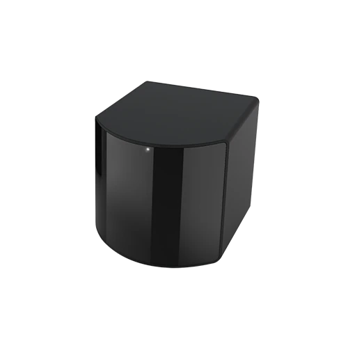
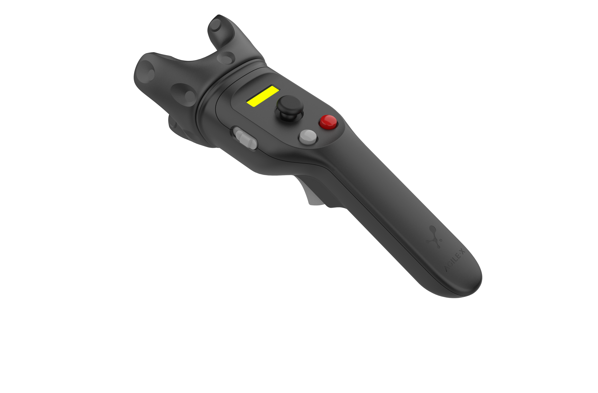
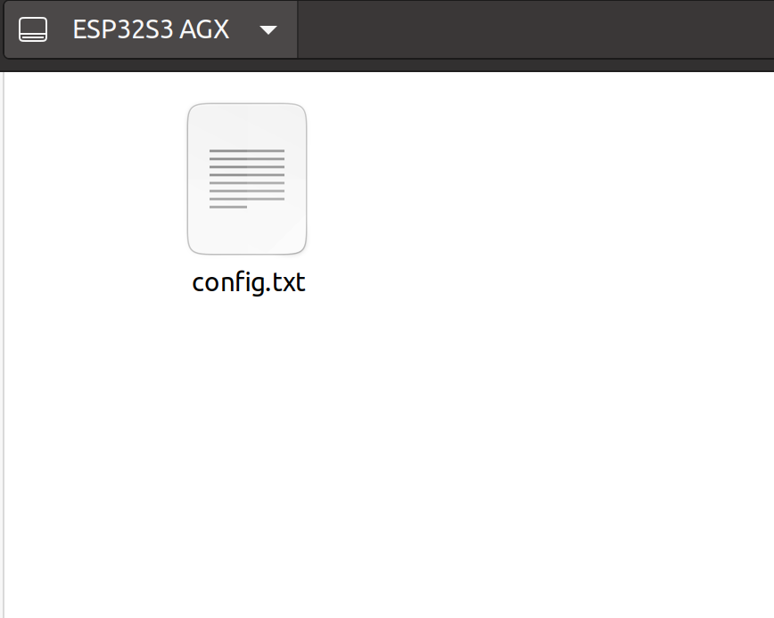
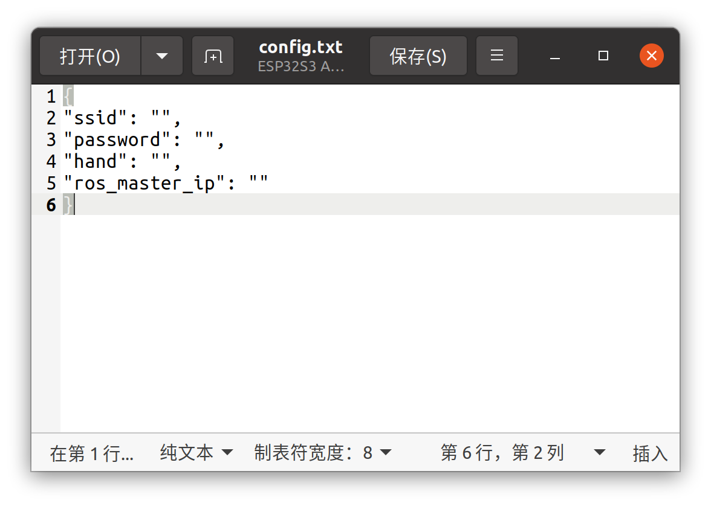
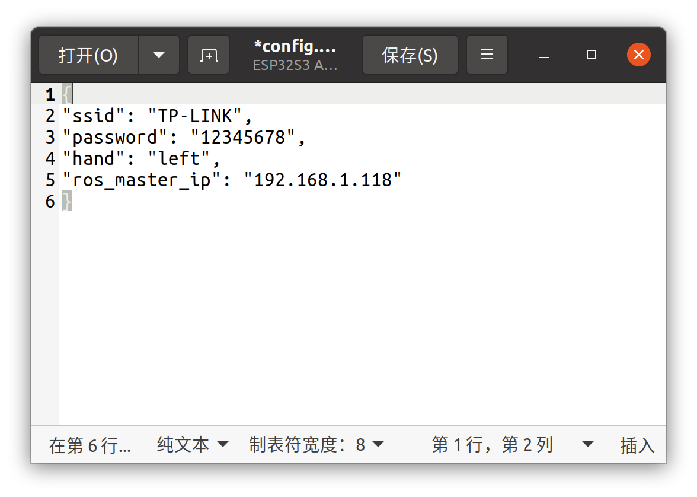
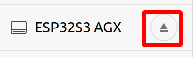
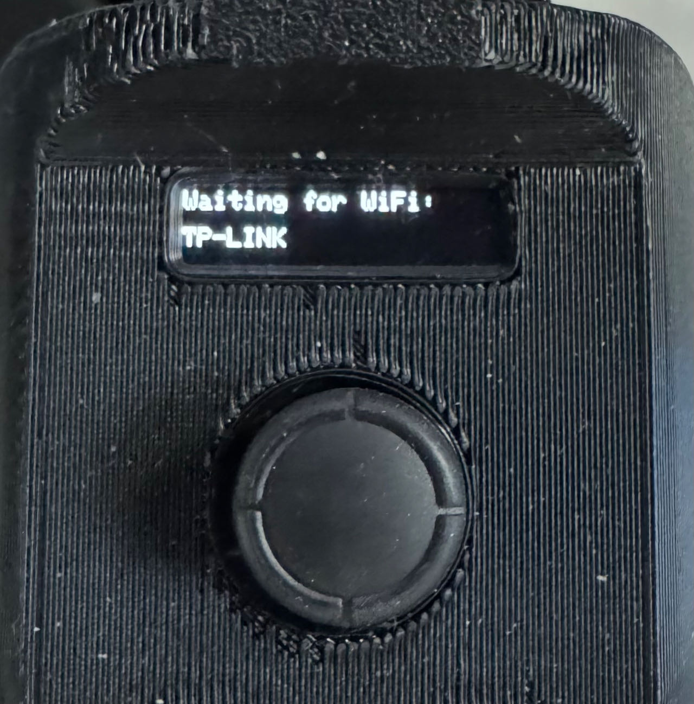
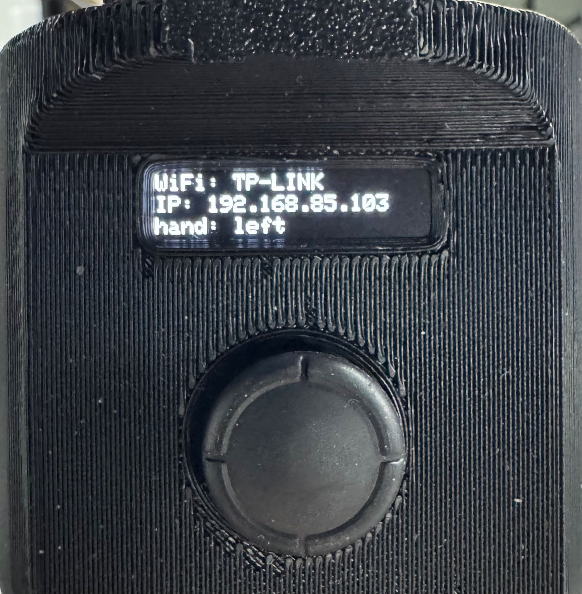
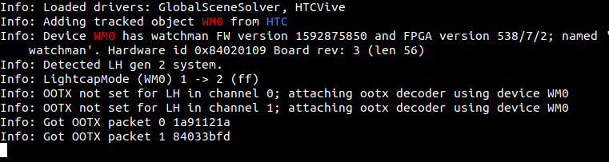
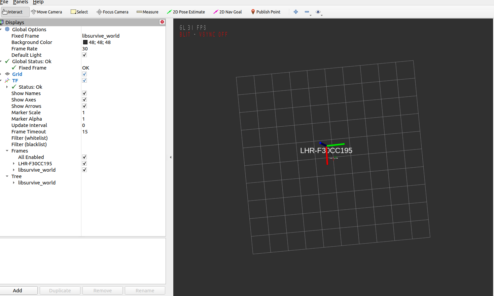

# Cobot Remote Developer Guide (开发者手册)

## 文件目录

``` bash
├── arm_adapter
├── ESP32
│   ├── esp32_c3
│   ├── esp32_s3
│   ├── espota.py
│   └── ota_remote.bash
├── interface
│   ├── arm_control
│   └── cr5_ros
├── lib
│   ├── libsurvive
│   └── vuer
├── oculus_reader
├── README.md
├── remote_bringup
├── TeleVision
└── vive_ros
```

其中主要包含三大独立的模块，也分别对应目前已知的三种遥操作方法：

### HTC VIVE空间操作单元：

基于HTC VIVE tracker 3.0以及HTC 定位基站2.0，XIAO esp32 S3主控芯片

```
├── arm_adapter
├── ESP32
├── interface
│   ├── arm_control
│   └── cr5_ros
├── lib
│   ├── libsurvive
├── remote_bringup
└── vive_ros
```

**arm_adapter**: 遥操作核心模块和机械臂交互的适配器，适配各种不同型号的机械臂

**ESP32**: 主控芯片源码，可使用Arduino IDE打开并编译

**interface**: 不同机械臂所使用的接口都放在里面

**lib**: 依赖库，实现追踪器的定位需要依赖libsurvive库

**remote_bringup**: 启动功能包

**vive_ros**: 依赖libsurvive库的ros功能包，负责发布定位器的tf坐标变换，手柄的按键话题

### VR手势遥操作:

基于oculus quest2，3，以及Apple Vision pro

```
├── TeleVision
│   ├── cert.pem
│   ├── img
│   │   └── television.jpg
│   ├── key.pem
│   ├── LICENSE
│   ├── mkcert-v1.4.4-linux-amd64
│   ├── README.md
│   ├── realsense_double_example.py
│   ├── realsense_example.py
│   ├── realsense_pointcloud.py
│   ├── TeleVision.py
│   └── zed_example.py
```

**cert.pem:**自签名证书，可以通过mkcert工具生成

**key.pem:**自签名证书密钥，mkcert工具生成

**mkcert-v1.4.4-linux-amd64:** mkcert工具的二进制文件，可以直接运行

**realsense_double_example.py:** 双realsense在沉浸式空间串流

**realsense_example.py:** 单个realsense相机在沉浸式空间串流

**realsense_pointcloud.py:** 单个相机的rgb点云在沉浸式空间的串流

**TeleVision.py:** 主要功能代码

**zed_example.py:** 原版仓库使用的示例


### VR控制器遥操作

基于meta quest2

```
├── oculus_reader
```

基于开源项目:https://github.com/rail-berkeley/oculus_reader


## HTC VIVE空间操作单元遥操作

### 准备工作

#### 定位基站



固定好两个定位基站，定位基站安装高度最好大于2m小于3m，向下俯视安装10-30度都可，保证在两个基站的视场内即可。官方的定位基站安装教程：https://www.vive.com/cn/support/vive-pro2/category_howto/tips-for-setting-up-base-station2.html

若是第一次使用定位基站，需要手动指定定位基站的频道。使用尖锐物体戳基站背后的按钮，按一次频道加一，范围从1-16，两个基站处于不同的频道即可

一切准备就绪后，定位基站led绿色常亮，代表运行正常

#### 遥操作手柄



如果是第一次连接配对手柄，需要设置:

 	1. 主机连接的wifi名称和密码
 	2. 左右手

1. 用usb数据线连接手柄到电脑，电脑弹出u盘选项，代表开始修改配置文件
    

2. 在配置文件中填入wifi名字，密码，以及左右手，保存并弹出u盘，再次挂载u盘并点开配置文件保存配置

    
    

3. 退出u盘
    

4. 再次挂载u盘，并点开config.txt，此时遥控器显示屏应该显示刚刚修改的wifi字样

	"waiting for WiFi:"

	"TP-LINK"

	

5. 此时退出u盘或拔掉数据线，等待wifi连接成功，显示wifi名，ip地址，左右手

	

#### 定位校准

若是第一次部署代码，需要编译依赖库:

``` bash
roscd remote_bringup
./script/build_survive.sh
```

若是第一次部署定位基站，或者定位基站发生了移动，定位效果不好，都应该进行校准:

```bash
./script/calibration_tracker.sh
```



启动校准程序后，手持遥控手柄，确保追踪器在两个定位基站的定位范围内

### 启动

1. 遥控器上电，确保基站已经上电，启动命令
- agilex机械臂：
``` bash
roslaunch remote_bringup agilex_remote.launch
```
- arx机械臂：
``` bash
roslaunch remote_bringup arx_remote.launch
```
​	启动代码后，此时代码不发送控制指令，rviz界面中显示追踪器的tf坐标:



2. 在rviz中确保追踪器的tf变换不抖动不异常，启动机械臂驱动，具体视不同机械臂而定
3. 同时长按2个按键，等待约1s后开始发送控制指令
4. 遥操作过程中，同时长按2个按键约1s，遥操作暂停
5. 暂停过程中按下摇杆按键，机械臂回归零点，遥操作结束

## VR远程手势遥操作:

项目主要基于开源工作的早期版本开发:

https://github.com/OpenTeleVision/TeleVision

该项目实际有更新和改进，本项目暂未跟进，依旧使用的最初始版本